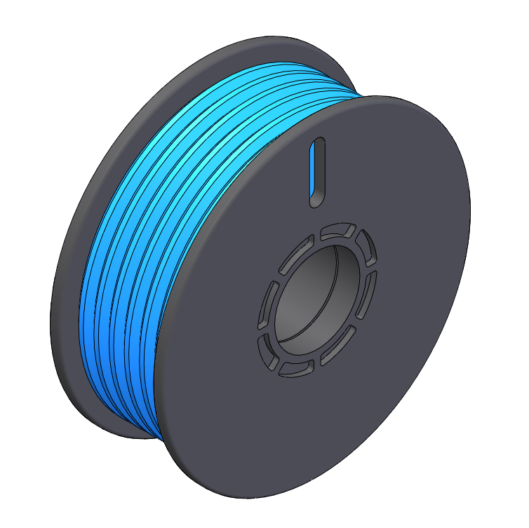
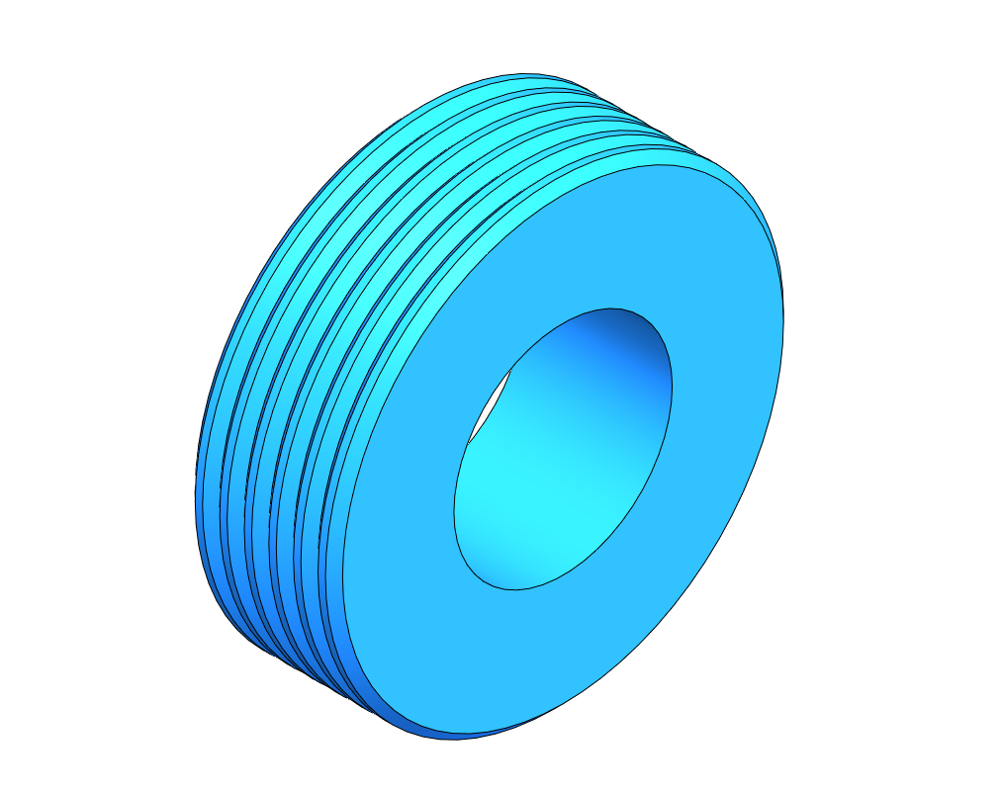

# Tiny Filament Spools

## Spools

|  |  |  |
|:-:|:-:|:-:|
| Flat | Single-Slot | Double-Slot |

## Components

|  |  |  |
|:-:|:-:|:-:|
| Male Spool | Female Spool | Filament |

## Assembly

|  |  |
|:-:|:-:|
| Exploded View | Exploded View - Animated |

# License

Tiny-Filament-Spools (c) 2022 by Kestin Goforth

Tiny-Filament-Spools is licensed under a Creative Commons Attribution 3.0 Unported License.

You should have received a copy of the license along with this work.  If not, see <http://creativecommons.org/licenses/by/3.0/>.